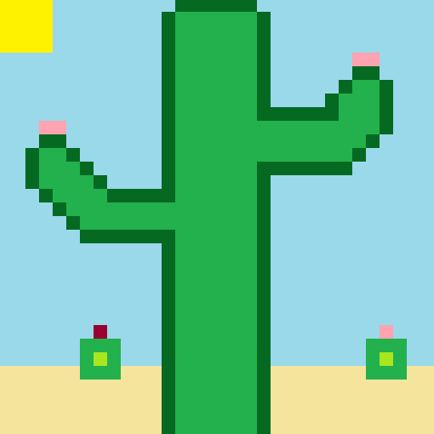
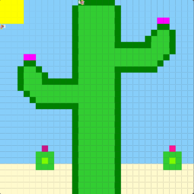

# Unit 1 - Asphalt Art

## Introduction

Cities use asphalt art to improve public safety, inspire their residents and visitors, and brighten communities. Your goal is to create asphalt art to revitalize The Neighborhood and bring the community together with the help of the Painter.

## Requirements

Use your knowledge of object-oriented programming, algorithms, the problem solving process, and decomposition strategies to create asphalt art:
- **Create a new subclass** – Create at least one new subclass of the PainterPlus class that is used for a component of the asphalt art design.
- **Plan an algorithm** – Use the problem solving process and decomposition strategies to plan an algorithm that incorporates a combination of sequencing, selection, and/or iteration.
- **Write a method** – Write at least one method in a PainterPlus subclass that contributes to a component of the asphalt art design.
- **Document your code** – Use comments to explain the purpose of the methods and code segments.

## Notes: Neighborhood & Painter Class

This project was created on Code.org's JavaLab platform using the built-in Neighborhood GUI output. To test and edit this project you must build in Code.org's JavaLab with the Neighborhood GUI enabled. For reference to the Painter class documentation, [you can read more here.](https://studio.code.org/docs/ide/javalab/classes/Painter)

## Output:
Pixelart Sketch:

Code.org result:

## Reflection

1. Describe your project.

   - My project is on the 32 x 32 canvas and it is about a cactus in the middle of a desert. In the images you see above, the sun is bright and yellow, there are no clouds in the sky (due to how hot it is), and there are mini cacti in the background but in the center is a giant cactuus that rules the desert and his name is CactusBoy (because that is what I made the subclass, don't tell him).

2. What are two things about your project that you are proud of?

   - I am proud that I got the result that I intended to get. I am also proud because while doing this project I learned how to use for loops and used them in my code.

3. Describe something you would improve or do differently if you had an opportunity to change something about your project.

   - If I had an opportunity to change something about my project, I would find out a way to make the amount of code I have smaller.

